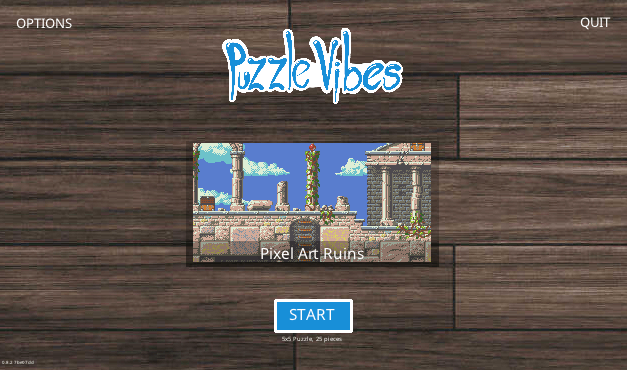

# Puzzle Vibes

A "jigsaw"-like puzzle game written in V.

<a href="https://blackgrain.itch.io/puzzle-vibes">Download and play pre-built versions of the game from itch.io</a>

The source code of Puzzle Vibes is free software covered by the [GPLv3 license](LICENSE).

Some in-game assets are licensed individually, please see [assets/images/images.txt](assets/images/images.txt), 
[assets/music/music.txt](assets/music/music.txt) and [assets/sfx/sfx.txt](assets/sfx/sfx.txt).

The Puzzle Vibes logo and icon is Copyright (c) 2022 Lars Pontoppidan.

# Running the game

To build and run the game please install [`shy`](https://github.com/larpon/shy) and then in the project root do:

Currently there's some bug with V's garbage collector that makes SDL crash, to avoid this use:

```bash
v -d sdl_memery_no_gc run .
```

If this is someday fixed everything should run fine with, just:

```bash
v run .
```



